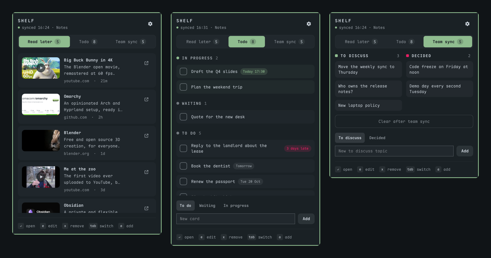

# Obsidian Shelf

Obsidian Shelf puts lists from your Obsidian vault in the Omarchy bar. You save
links, tasks and notes on your phone, and you handle them from the desktop
without opening Obsidian.



## What it does

- **Four kinds of lists**, read from plain Markdown files: links to read or
  watch (a folder, one note per link), checklists, boards (the file of the
  Obsidian Kanban plugin) and notes by section.
- **Act from the bar**: open a link, tick a task, move a card to another
  lane, give it a date, add a line, edit or remove an item, clear a notes
  file after a meeting.
- **Reminders**: a card with a date and a time rings at that time, and a
  morning summary lists the cards due today and the late ones.
- **Previews**: YouTube thumbnails, tweet pictures, and the preview image and
  title of most other pages, Instagram and Reddit included.
- **A chip so you do not forget**: it shows how many items wait in the lists
  you choose. A dot marks a new arrival until you open the popup, on every
  screen.
- **Obsidian Sync without the app**: a guide in the popup sets up Obsidian
  Headless, so captures reach the desktop while Obsidian does not run.
- **Your theme**: every color comes from the active Omarchy theme, and the
  motion follows the shell's animation setting.

## Install

```bash
omarchy plugin add https://github.com/tmn73/omarchy-obsidian-shelf.git --enable
```

Click the chip in the bar. The first time, the popup asks for your vault (it
lists the vaults Obsidian knows), then helps you add your first list. It
suggests the lists it finds in the vault.

### Requirements

- Omarchy Quattro, with its Quickshell shell.
- `python3` (standard library only) and `xdg-open`. Omarchy has both.
- Optional: Obsidian Headless (`ob`), to sync the vault while the Obsidian app
  does not run. The sync guide installs it with `bun` or `npm`. See [Sync](#sync).

## Remove

```bash
omarchy plugin remove tmn73.obsidian
```

The plugin never changes your notes when you remove it. Two things can stay:

- The preview cache. Remove it with `rm -r ~/.cache/obsidian-shelf`.
- The background sync, if the guide started it. It does not need the plugin,
  so it keeps your vault in sync. To stop it:

  ```bash
  systemctl --user disable --now obsidian-headless.service
  rm ~/.config/systemd/user/obsidian-headless.service
  systemctl --user daemon-reload
  ```

## The four kinds of lists

| Kind | What it reads | One item is | Actions |
| --- | --- | --- | --- |
| Links to read or watch | every `.md` file directly in a folder | one note | open its link, edit its title, remove it |
| A checklist | one file | one `- [ ] text` line | tick, add, edit, remove |
| A board | one Kanban plugin file | one `- [ ] text` card under a `## ` lane | tick, move, date, add to a lane, edit, remove, clear Done |
| Notes by section | one file | one `- text` bullet under a heading | add under a heading, edit, remove, clear all |

Details:

- **Links**: the title is the `title` key of the front matter, else the first
  `# ` heading, else the file name. The link is the `url`, `source` or `link`
  key of the front matter, else the first web address in the note. Removing a
  link moves the note to the `.trash` folder of the vault, where Obsidian can
  restore it. Editing a title writes the `title` key and leaves the note body
  as it is.
- **Checklists**: a tick removes the line by default. A list can write `[x]`
  instead. Lines ticked on the phone (`- [x]`) do not show, and the plugin
  removes them at its next write to the file.
- **Boards**: the file of the Obsidian Kanban plugin, so the phone shows the
  same board. The lane closest to Done shows first, and the Complete lane
  (the one with `**Complete**` under its heading) folds at the bottom. A tick
  moves a card to the Complete lane. A date is `@{2026-10-20}` and a time is
  `@@{14:30}` at the end of the card, as the plugin writes them. The chip
  count turns red while a card is late.
- **Notes by section**: a section starts at a heading (`#` to `######`). Use
  it for a meeting agenda (To discuss / Decided), a list by status (This
  week / Later) or a retrospective (Good / Bad). Clear removes every bullet
  and keeps the headings.

The plugin ignores lines that do not match these formats, and it never
rewrites them. Before each write it reads the file again and finds the item
by its text, so a capture that synced in a second ago stays.

## Add from your phone

Obsidian on the phone writes the files, and the sync brings them here. Each
list in the settings has an "Add from your phone: how" note. In short:

- **Links**: install the ReadItLater community plugin in Obsidian mobile and
  set its inbox folder to the folder of your links list. Then share any link
  to Obsidian and pick ReadItLater.
- **Boards**: install the Kanban community plugin to see the board on the
  phone. To add from the pull-down, give QuickAdd a Capture to the board
  file with "Insert after" set to your first lane, such as `## To do`.
- **Checklists and notes**: install the QuickAdd community plugin and add a
  Capture to the file: `- [ ] {{VALUE}}` for a checklist, "Choose heading when
  capturing" for notes by section. Then pick "QuickAdd: Run" in Settings >
  Interface > Configure mobile Quick Action, and pull down to add a line.

## Sync

The plugin reads local files. With Obsidian Sync, the files on the desktop
change only while a sync client runs. The popup guides you through Obsidian
Headless, the official client that needs no app, one step at a time:

1. Install it (`bun add -g obsidian-headless`, or npm with Node 22 or later).
2. Log in. A terminal opens, and the password goes to `ob`, never to the plugin.
3. Link the vault folder to one of your remote vaults.
4. Start the background sync. A user service runs it now and at every login.

Then pause Sync in the Obsidian app on this PC (Settings, Sync, Pause). The
app still opens and edits the vault, and Obsidian Headless sends your changes.

If you sync another way (Syncthing, git, the Obsidian app left open), turn
the guide off in the settings. An optional command can tell the chip when
your own sync stops.

## Reminders

Each board has a "Remind me" setting, on by default.

- A card with a date and a time rings once, at that time, as an Omarchy
  notification. A click on it opens the shelf. When the PC was off at that
  time, it rings when the shelf starts again that same day.
- The morning summary rings once a day at the summary time (09:00, a
  setting). It lists the cards due today without a time and every late card.
  A day with nothing due sends nothing.
- A reminder plays a sound, on by default. The settings let you turn it off
  or pick another one among the sounds already on the system (the sound
  themes in `/usr/share/sounds` and `~/.local/share/sounds`). The plugin ships
  no sound. The default is the alarm sound of the freedesktop theme.
- With a bar on each screen, one notification still goes out: the helper
  works under a lock and keeps what it sent in
  `~/.local/state/obsidian-shelf/reminders.json`.

## Previews and privacy

- **Link previews** (on by default): for a saved link that has no picture or
  no title, the plugin reads the page once and keeps its preview image and
  title in a local cache. It asks with the user agent that chat apps use for
  link previews, because many sites give their preview tags only to those.
  Only the site sees the request.
- **Only public addresses**: every request of the helper, each redirect
  included, resolves the name first and stops when an address is not on the
  public internet (`localhost`, your home network, link-local, CGNAT). It
  then connects to the address it checked, so a second lookup cannot change
  the target.
- **Pictures** (thumbnails, author pictures) go through the same checks: the
  helper downloads them into `~/.cache/obsidian-shelf/images`, and the bar
  shows only those local files. The shell never loads a web address itself.
- **Tweet previews** (off by default): the author picture and first photo of
  a tweet come from api.fxtwitter.com, once per tweet. That service sees the
  links of the tweets you save.
- The plugin sends nothing anywhere else, and a preview never changes a note
  in the vault.
- Text from the vault never goes into a command line, which every local user
  can read in the process list. The helper reads items, lanes and new text on
  stdin, and it sends reminders to the session D-Bus itself, without
  `notify-send`. Opening a link gives its address to `xdg-open`, as any app
  does when it opens a link.

## Settings

Open them with the gear in the popup:

- the vault, and the sync status,
- your lists in tab order: move them, rename them, point them at another
  folder or file, choose what a tick does, and choose whether a list
  **notifies** (its items count on the chip, and a new item pings it and
  shows the dot),
- add a list, from the suggestions found in the vault or from a kind,
- link and tweet previews, and how often the plugin reads the vault (10 s,
  30 s or 1 min).

Removing a list from the shelf keeps its file. The message that follows
can also move the file to the `.trash` folder of the vault, where Obsidian
keeps the files it takes out. A folder goes only when it is empty.

## Keys

| Key | Action |
| --- | --- |
| Tab, Shift+Tab | next or previous list |
| Up, Down | move in the list |
| Enter | open the link, or tick the task or the card |
| `s` | open the status menu of a card |
| Left, Right | move a card to the lane before or after |
| `t` | give a card a date |
| `e` | edit the item |
| `x`, `Del` | remove the item |
| `d` | done: tick a task, remove a link |
| `a` | go to the add field |
| `r` | read the vault again |
| Escape | close |

## Development

```bash
bash tests/run-all.sh
```

This runs the helper tests (`python3 -m unittest`), the model tests
(`node --test`), the QML source checks, the setup script checks and
`omarchy plugin validate`.

- `bin/obsidian-shelf` and `helper/`: the only code that reads or writes the
  vault, and the only code that goes to the network. Python standard library
  only.
- `Model.js`: pure logic, tested under node.
- `Service.qml` reads the vault, and `SyncGuide.qml` follows the sync setup.
- The other QML files are small components: the chip, the popup, one list per
  kind, the settings and the add sheet.

Install your local copy, then update it after each commit:

```bash
omarchy plugin add file://$PWD --enable --yes
omarchy plugin update tmn73.obsidian --yes
```

## License

MIT
